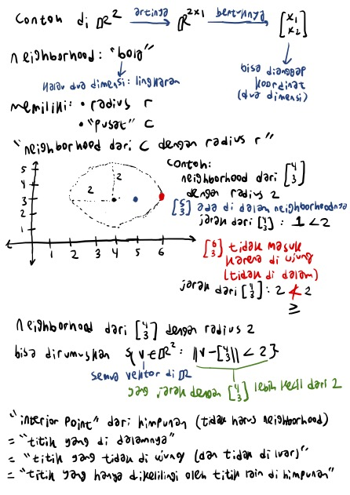
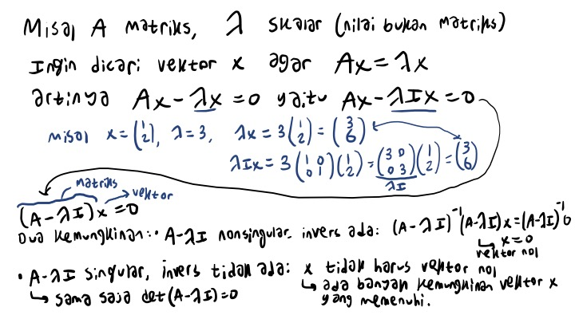
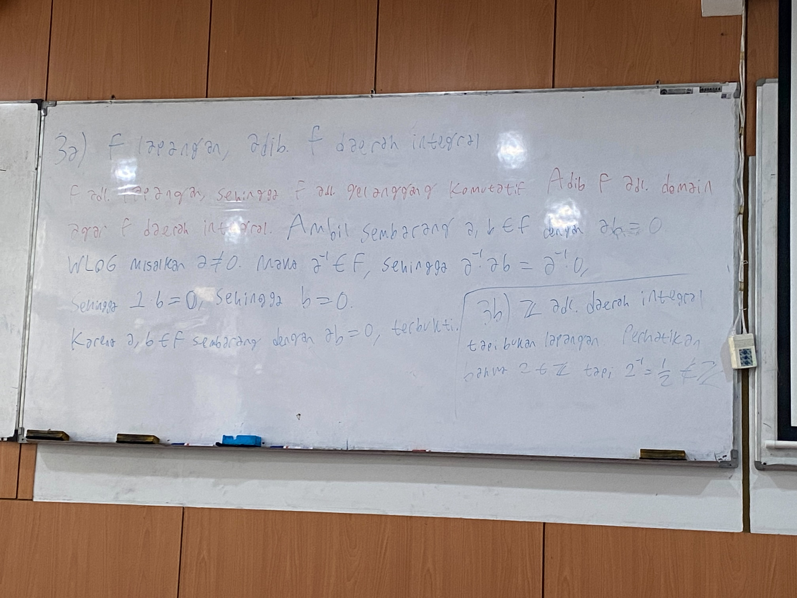
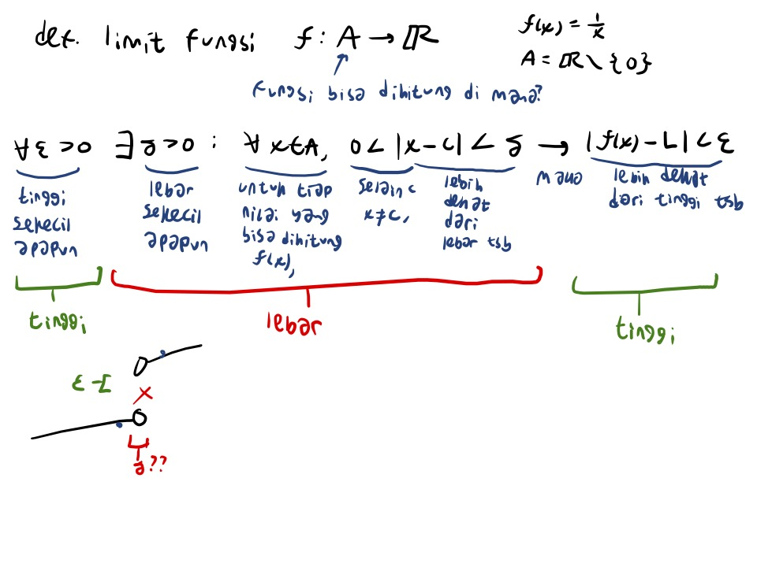

[Back to Home](../index.qmd)

::: {.list-table aligns="c,c,c"}
**At a glance**

- - 4+ years
  - 400+ students
  - Pure/theoretical and applied subjects

- - University teaching + freelance tutoring
  - Through several years of undergraduate mathematics
  - Calculus/analysis, linear/abstract algebra, programming, numerical methods, data
:::

# Gallery & samples

::: {.panel-tabset}

## Calculus, linear algebra

- Solids of revolution: slice, approximate, integrate (in Indonesian)

  [slice_approximate_integrate_indonesian.pdf](gallery_samples/calculus/slice_approximate_integrate_indonesian.pdf)

  

- Basic topology on $\mathbb{R}^n$: neighborhoods, interior points, open sets, continuity (in Indonesian)

  [Rn_topology_functions_indonesian.pdf](gallery_samples/calculus/Rn_topology_functions_indonesian)

  

- Intro to eigenvalues (in Indonesian)

  [eigenvalues_intro_indonesian.pdf](gallery_samples/linear_algebra/eigenvalues_intro_indonesian.pdf)

  

- Wolfram Mathematica: solving a definite integral (in Indonesian)

  

- Wolfram Mathematica: solving a linear system (in Indonesian)

  

## Abstract algebra, real analysis

- The remainder group $\mathbb{Z}_n$ (in English)

  [remainder_group_english_2026.pdf](gallery_samples/abstract_algebra/remainder_group_english_2026.pdf)

  

- Fields are integral domains, but not vice versa (in Indonesian)

  

- Exercise: ideals generated by polynomials in a polynomial ring (in Indonesian)

  [polynomial_ideal_exercise_indonesian.pdf](gallery_samples/abstract_algebra/polynomial_ideal_exercise_indonesian.pdf)

  

- Introduction to convergent sequences in $\mathbb{R}$ (in Indonesian)

  [convergent_sequence_intro_indonesian.pdf](gallery_samples/real_analysis/convergent_sequence_intro_indonesian.pdf)

  

- Introduction to the definition of the limit (in Indonesian)

  [limit_definition_intro_indonesian.pdf](gallery_samples/real_analysis/limit_definition_intro_indonesian.pdf)

  

## Programming, numerical methods

Samples to be published soon!

## Data structures, data science

Samples to be published soon!

:::

